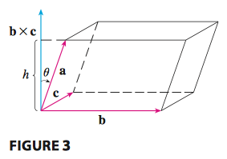
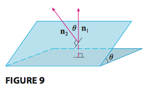

# Vectors and Vector Functions

[TOC]

## Goals

## Vectors, Dot Product, Cross Product

### Vectors

If we place the initial point of a vector $\mathbf{a}$ at the origin of a rectangular coordinate system, then the termial point of $\mathbf{a}$ has coordinates of the form $(a_1, a_2)$ or $(a_1, a_2, a_3)$. These coordinates are called the **components**. $\mathbf{a} = \langle a_1, a_2 \rangle$ or $\mathbf{a} = \langle a_1, a_2, a_3 \rangle$.

Given the points $A(x_1, y_1, z_1)$ and $B(x_2, y_2, z_2)$, the vector $\mathbf{a}$ with **representation** $\overrightarrow{AB}$ is $\mathbf{a} = \langle x_2 - x_1, y_2 - y_1, z_2 - z_1 \rangle$.

The length of the three-dimensional vector $\mathbf{a} = \langle a_1, a_2, a_3 \rangle$ is $|\mathbf{a}| = \sqrt{a_1^2 + a_2^2 + a_3^2}$. A **unit vector** is a vector whose length is 1. The unit vector that has the same direction as $\mathbf{a}$ is $\mathbf{u} = \frac{\mathbf{a}}{|\mathbf{a}|}$.

Vector $\mathbf{a} = \langle a_1, a_2, a_3 \rangle$ could be rewrite $\mathbf{a} = a_1\mathbf{i} + a_2\mathbf{j} + a_3\mathbf{k}$, where $\mathbf{i} = \langle1,0,0\rangle, \mathbf{j} = \langle0,1,0\rangle, \mathbf{k} = \langle0,0,1\rangle$ are called **standard basis vectors**. They have length 1 and the directions of positive x-, y-, and z-axes.

### Dot Product

**Definition** If $\mathbf{a} = \langle a_1, a_2, a_3 \rangle$ and $\mathbf{b} = \langle b_1, b_2, b_3 \rangle$, then the dot product $\mathbf{a}\cdot\mathbf{b} = a_1 b_1 + a_2 b_2 + a_3 b_3$. 

**Theorem** If $\theta$ is the angle between vectors $\mathbf{a}$ and $\mathbf{b}$, then $\mathbf{a}\cdot\mathbf{b} = |\mathbf{a}| |\mathbf{b}| \cos \theta$. The vectors are orthogonal if and only if $\mathbf{a}\cdot\mathbf{b} = 0$.

- Scalar projection of $\mathbf{b}$ onto $\mathbf{a}$: $comp_ab = |\mathbf{b}| \cdot \cos \theta = \frac{\mathbf{a}\cdot\mathbf{b}}{|\mathbf{a}|}$.
- Vector projection of $\mathbf{b}$ onto $\mathbf{a}$: $proj_ab = comp_ab \cdot \frac{\mathbf{a}}{|\mathbf{a}|} = \frac{\mathbf{a}\cdot\mathbf{b}}{|\mathbf{a}|^2} \mathbf{a}$

### Cross Product

**Definition** If $\mathbf{a} = \langle a_1, a_2, a_3 \rangle$ and $\mathbf{b} = \langle b_1, b_2, b_3 \rangle$, then the cross product $\mathbf{a} \times \mathbf{b} = \langle a_2 b_3 - a_3 b_2, a_3 b_1 - a_1 b_3, a_1 b_2 - a_2 b_1 \rangle$. We often write

$$\begin{vmatrix}\mathbf{i} & \mathbf{j} & \mathbf{k} \\ a_1 & a_2 & a_3 \\ b_1 & b_2 & b_3 \end{vmatrix}$$

**Theorem** The vector $\mathbf{a} \times \mathbf{b}$ is orthogonal to both $\mathbf{a}$ and $\mathbf{b}$ (right-hand rule). 

**Theorem** If $\theta$ is the angle between $\mathbf{a}$ and $\mathbf{b}$ (so $0 \le \theta \le \pi$), then $\mathbf{a} \times \mathbf{b} = |\mathbf{a}| |\mathbf{b}| \sin \theta$. The 2 vectors are parallel if and only if $\mathbf{a} \times \mathbf{b} = \mathbf{0}$. The length of the cross product $\mathbf{a} \times \mathbf{b}$ is equal to the area of the parallelogram determined by $\mathbf{a}$ and $\mathbf{b}$.

The volume of the parallelepiped determined by the 3 vectors is the magnitude of their scalar triple product $V = |\mathbf{a} \cdot (\mathbf{b} \times \mathbf{c})|$

$$\mathbf{a} \cdot (\mathbf{b} \times \mathbf{c}) = \begin{vmatrix}\ a_1 & a_2 & a_3 \\ b_1 & b_2 & b_3 \\ c_1 & c_2 & c_3\end{vmatrix}$$

## Equations of Lines and Planes

### Lines

The **vector equation for a line** $L$ is $\mathbf{r} = \mathbf{r}_0 + t \mathbf{v}$.

The **parametric equation for a line** through the poin $(x_0, y_0, z_0)$ and parallel to the direction vector $\langle a, b, c \rangle$ are $x = x_0 + a t, y = y_0 + b t, z = z_0 + c t$.

The line segement from $\mathbf{r}_0$ and $\mathbf{r}_1$ is given by the vector equation $ \mathbf{r} (t) = (1 - t) \mathbf{r}_0 + t \mathbf{r}_1, 0 \le t \le 1$.

### Planes

The **vector equation of the plane** is $\mathbf{n} \cdot (\mathbf{r} - \mathbf{r}_0) = 0$, where $\mathbf{n}$ is called a normal vector which is orthogonal to the plane, and $\mathbf{r}_0$ is a vector in the plane.

>  A plane is determined by its normal vector and another vector lie on the plane.

The **scalar equation of the plane** through point $P_0(x_0, y_0, z_0)$ with normal vector $\mathbf{n} = \langle a, b, c \rangle$ is $a (x - x_0) + b (y - y_0) + c (z - z_0) = 0$, which can be rewrite to **linear equation** $a x + b y + c z + d = 0$.

Two planes are parallel if their normal vectors are parallel. If two planes are not parallel, then they intersect in a straight line and the angle between the two planes is defined as the acute angle between their normal vectors.

#### Example

*Example 1* Find the scalar equation of the line of intersection $L$ of two planes $x + y + z = 1$, $x - 2y + 3z = 1$

Since $L$ is on both planes, it must be perpendicular to both normal vectors, thus the direction is the cross product of the two normal vectors $\mathbf{v} = \mathbf{n}_1 \times \mathbf{n}_2 = \langle 5, -2, -3 \rangle$ . So the scalar equation is $x = 1 + 5 t, y = 1 - 2 t, z = 1 - 3 t$.

*Example 2* Find a formula for the distance $D$ from a point $P_1(x_1, y_1, z_1)$ to the plane $a x+ b y + c z = 0$.

The normal vector is $\mathbf{n} = \langle a, b, c \rangle$. Find any point $P_0$ in the plane, and the distance $D$ is the scalar projection from $\overrightarrow{P_1 P_0}$ to $\mathbf{n}$. Suppose $\mathbf{b} = \overrightarrow{P_1 P_0}$, then $D = |comp_n \mathbf{b}| = \frac{|\mathbf{n} \cdot \mathbf{b}|}{|\mathbf{n}|} = \frac{|a x_1 + b y_1 + c z_1 + d|}{\sqrt{a^2 + b^2 + c^2}}$.

## Vector Functions and Space Curves

## Derivatives and Integrals of Vector Functions

## Arc Length and Curvature

## Motion in Space: Velocity and Acceleration

